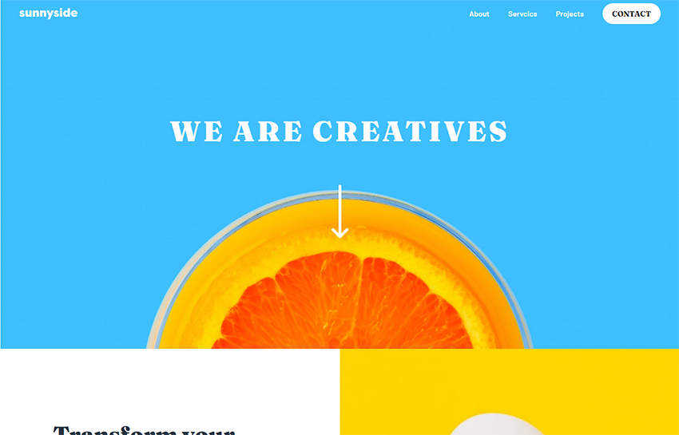

# Frontend Mentor - Sunnyside agency landing page solution

This is a solution to the [Sunnyside agency landing page challenge on Frontend Mentor](https://www.frontendmentor.io/challenges/sunnyside-agency-landing-page-7yVs3B6ef).

### Screenshot



### Links

- Solution URL: [Solution](https://your-solution-url.com)

## My process

### Built with

- [React](https://reactjs.org/) - JS library
- [tailwind](https://tailwindcss.com/) - For styles

### What I learned

I used this project to learn tailwindcss and to gain a better understanding of React Dynamic Components.

customized the default tailwind theme

```js
theme: {
    container: {
      center: true,
    },
    extend: {
      colors: {
        softRed: 'hsl(7, 99%, 70%)',
        yellow: 'hsl(51, 100%, 49%)',
        darkDesaturatedCyan: 'hsl(167, 40%, 24%)',
        darkBlue: 'hsl(198, 62%, 26%)',
        darkModerateCyan: 'hsl(168, 34%, 41%)',
        veryDarkDesaturatedBlue: 'hsl(212, 27%, 19%)',
        veryDarkGrayishBlue: 'hsl(213, 9%, 39%)',
        darkGrayishBlue: 'hsl(232, 10%, 55%)',
        grayishBlue: 'hsl(210, 4%, 67%)',
        white: 'hsl(0, 0%, 100%)',
      },
      fontFamily: {
        Barlow: ['Barlow', 'sans-serif'],
        Fraunces: ['Fraunces', 'serif'],
      },
    },
    screens: {
      xs: '480px',
      ss: '620px',
      sm: '640px',
      md: '768px',
      lg: '1024px',
      xl: '1280px',
      '2xl': '1440px',
    },
    backgroundImage: {
      'hero-desk': "url('./assets/img/desktop/image-header.jpg')",
      'hero-mob': "url('./assets/img/mobile/image-header.jpg')",
      'card-graphic': "url('./assets/img/desktop/image-graphic-design.jpg')",
      'card-photo': "url('./assets/img/desktop/image-photography.jpg')",
    },
  }
```

## Author

- Website - [Rowan Connaughton](https://rowanconnaughton.com/)
- Frontend Mentor - [@RowanConnaughton](https://www.frontendmentor.io/profile/RowanConnaughton)
